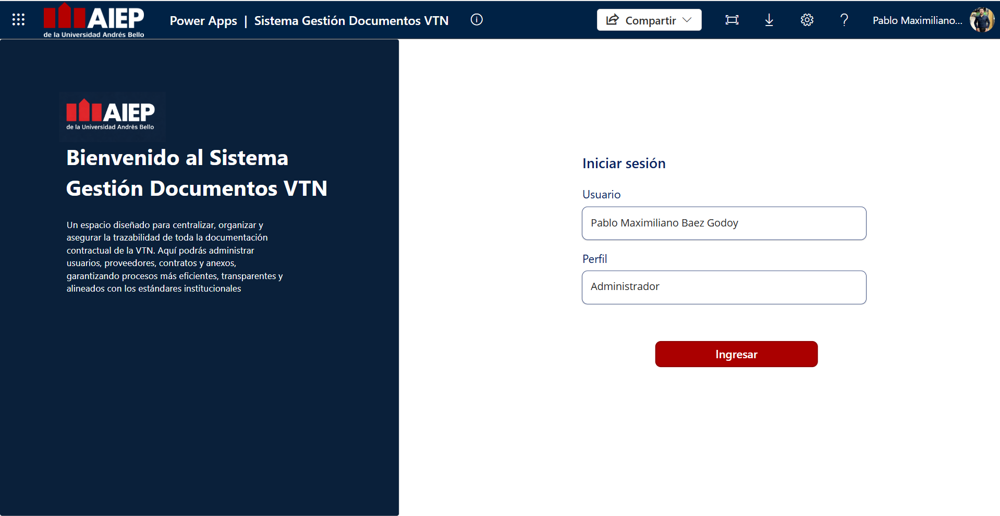

# Sistema Gestión Documentos VTN

Aplicación desarrollada en Microsoft Power Platform (Power Apps + SharePoint) para el área de Vicerrectoría de Transformación y Nuevas Soluciones (VTN) del Instituto Profesional AIEP. El sistema centraliza, organiza y asegura la trazabilidad de toda la documentación contractual de la VTN, permitiendo administrar proveedores, contratos, órdenes de compra, facturas y usuarios en un solo lugar.

  

 

## 🚀 ¿Qué realiza el sistema aplicativo?

Aplicación desarrollada en Microsoft Power Platform (Power Apps + SharePoint) para el área de Vicerrectoría de Transformación y Nuevas Soluciones (VTN) del Instituto Profesional AIEP. El sistema centraliza, organiza y asegura la trazabilidad de toda la documentación contractual de la VTN, permitiendo administrar proveedores, contratos, órdenes de compra, facturas y usuarios en un solo lugar.

Autor: Pablo Maximiliano Báez Godoy
Institución: Instituto Profesional AIEP
Área: Vicerrectoría de Transformación y Nuevas Soluciones

Stack tecnológico

Power Apps (Canvas App) — interfaz de usuario
SharePoint — almacenamiento de datos y documentos (listas y bibliotecas)
Power Automate — automatizaciones del flujo de trabajo (historial de cambios, notificaciones, etc.)

Funcionalidades principales

1. Administrar proveedores

Creación, edición, búsqueda y eliminación de proveedores.
Registro de RUT, responsable, correo de contacto, nacionalidad societaria y fecha de creación.
Adjuntar documentos asociados a cada proveedor.
Historial de modificaciones con detalle de campo modificado, usuario y fecha.

2. Gestionar contratos

Alta, edición, búsqueda y eliminación de contratos y anexos.
Campos como ID Webdox, ID SAP, tipo de contrato, monto, moneda, cláusulas de término anticipado, fechas de inicio/término, entre otros.
Estados automáticos: Vigente, Por vencer, Vencido.
Gestión de órdenes de compra asociadas a cada contrato (crear, editar, eliminar).
Asociación de facturas a cada orden de compra, con documentos adjuntos.
Historial de modificaciones de contratos.

3. Panel de documentos

Consulta y descarga de todos los documentos adjuntos, organizados por proveedor o por contrato.
Visor de documentos integrado (PDF) con búsqueda y filtros (por estado, nombre, etc.).

4. Administrar usuarios

Creación, edición y eliminación de usuarios del sistema.
Asignación de perfiles (Administrador / Usuario) y estado (Activo/Inactivo).
Autocompletado de datos desde el directorio de la organización (Office 365).

Capturas del sistema

El PDF adjunto (Sistema_Gestion_Documentos_VTN.pdf) contiene la visualización completa del sistema, con sus funcionalidades.

Pantalla de inicio de sesión y home
CRUD completo de proveedores, contratos, órdenes de compra y facturas
Historial de modificaciones (auditoría)
Panel de documentos con visor integrado
Administración de usuarios
Vista del sitio SharePoint asociado

La información es almacenada en un sitio documental de Sharepoint.
